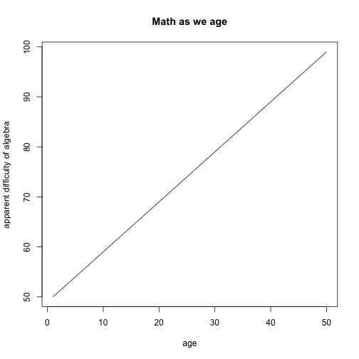

Course Project: Sums
========================================================
author: Heather Murray
date: March 20, 2015

My Project
========================================================

My course project is a few macaronis short of passing first grade.

- It takes the input of two sliders and sums them
- Easy peasy

My ui.R
========================================================


```r
library(shiny)
shinyUI(fluidPage(
  titlePanel("Course Project"),
  sidebarLayout(
    sidebarPanel("sidebar",
    sliderInput("n_1", label = "First Number", min = 0, max = 100, value = 5, step = 1),
    sliderInput("n_2", label = "Number2", min = 0, max = 100, value = 5, step = 1)
  ),
        mainPanel("Your Sum Is",
        textOutput("text1")
        )
        )
)
)  
```

<!--html_preserve--><div class="container-fluid">
<h2>Course Project</h2>
<div class="row">
<div class="col-sm-4">
<form class="well">
sidebar
<div class="form-group shiny-input-container">
<label class="control-label" for="n_1">First Number</label>
<input class="js-range-slider" id="n_1" data-min="0" data-max="100" data-from="5" data-step="1" data-grid="true" data-grid-num="10" data-grid-snap="false" data-prettify-separator="," data-keyboard="true" data-keyboard-step="1"/>
</div>
<div class="form-group shiny-input-container">
<label class="control-label" for="n_2">Number2</label>
<input class="js-range-slider" id="n_2" data-min="0" data-max="100" data-from="5" data-step="1" data-grid="true" data-grid-num="10" data-grid-snap="false" data-prettify-separator="," data-keyboard="true" data-keyboard-step="1"/>
</div>
</form>
</div>
<div class="col-sm-8">
Your Sum Is
<div id="text1" class="shiny-text-output"></div>
</div>
</div>
</div><!--/html_preserve-->

My server.R
========================================================


```r
shinyServer(function(input, output){
  output$text1 <- renderText({
    paste("your input sums to", sum(input$n_1, input$n_2))
    })
                              
})
```

Why do we need this? 
========================================================
 
THE END
========================================================
